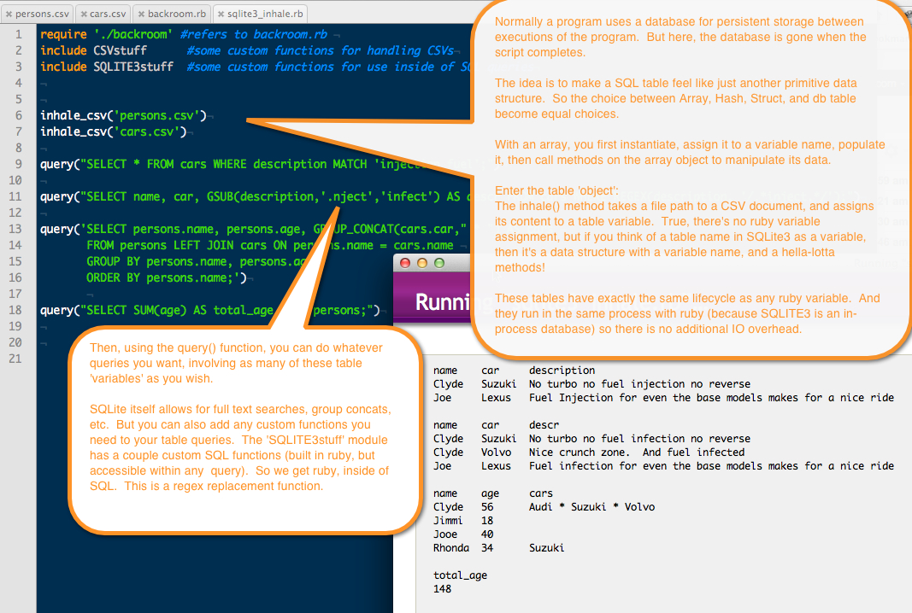

# ruby_in_sql_in_ruby
This library allows you to a SQL table like just another primitive data structure, like Array, Struct, Hash.  It even exists in the same memory space, so there's no IO overhead.  A bonus is that you can define any SQL function you wish for the database using ruby code. 

This is useful for data scientist types who write snippets of disposable code to quickly pull data from different data sources, combine the results, run some queries, report findings, 'rinse and repeat'.  So you import external data directly into sqlite tables treat them as normal primitives, but the methods on those table objects are native to SQLite and also any functions you wish to add.  There are a few examples in the code.  Of course the sqlite database contains all the tables so they can be joined, etc.  The syntax of SQL has always bothered me.  In general I believe the langage could be refined to 60% the amount of text.  Since ruby is building SQL code in this library, we have begun to redesign SQL slightly to take advantage of defaults.  For example, if you join two tables you must always specify the keys.  But if you don't, then the code should be able to find an obvious match.

